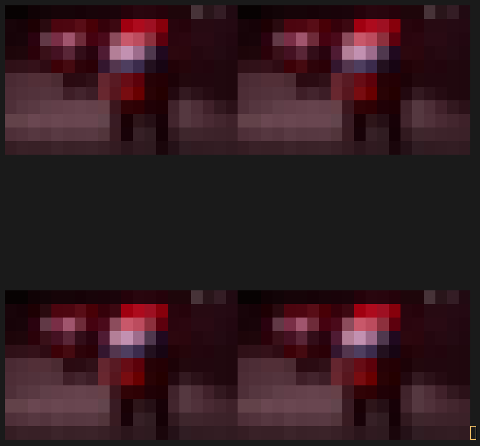

# TermVideoPlayer


## About

This Python script will let you play `ffmpeg`-readable videos on your terminal (with audio)!

**This project is experimental**: I haven't tested all possible formats so some may not work.

## Usage

`$ python main.py --help`

`$ python main.py play --help`

Usage is explained within the help prompts.

### Examples

Open `video.mp4`, set pixel width to 2 chars, and video height to 64 chars (keep aspect-ratio):
- `$ python main.py play video.mp4 :2x64`

Open `video.mp4`, set video width to 10 chars (keep aspect-ratio):
- `$ python main.py play video.mp4 10x`

Open `video.mp4`, set video height to 10 chars (keep aspect-ratio), set origin to (6,3) and disable audio:
- `$ python main.py play video.mp4 x10 -o6p3 --no-audio`

## Features

### Tiling

**Note:** These examples show how to achieve tiling of images.
It can also be done with videos if your terminal supports running multiple commands in the background.

**Linux:**
```sh
#!/bin/sh
./main.py play image.jpg 20x -nc -na -CB 20x20 -o1p1
./main.py play image.jpg 20x -nc -na -CB 20x20 -o41p1
./main.py play image.jpg 20x -nc -na -CB 20x20 -o1p21
./main.py play image.jpg 20x -nc -na -CB 20x20 -o41p21

# On Linux it's possible to easily tile videos by
#  putting "&" at the end of each play command (running them async),
#  and "wait" after all commands (joining them at the end).
# Just remember to remove the "-nc" and "-na" options.
# See below for more info on "-nc" and "-na".
```

**Windows:**
```bat
@echo off
python main.py play image.jpg 20x -nc -na -CB 20x20 -o1p1
python main.py play image.jpg 20x -nc -na -CB 20x20 -o41p1
python main.py play image.jpg 20x -nc -na -CB 20x20 -o1p21
python main.py play image.jpg 20x -nc -na -CB 20x20 -o41p21
```

Here the `-C` (`--align-center`) option aligns the image to the center of its bounding box.

While the `-B` (`--bounding-box`) option specifies the max width and height of the image.
Its format is the same as the resolution, if pixel_width is not specified, it is the same as the one provided within the resolution argument.

Other options such as `-nc` and `-na` are needed to, respectively, not clear the terminal, and disabling audio.
Both options are not needed when tiling videos.

**Note:** Audio does not really need to be disabled to display images. However, `portaudio`, for some reason, has logging enabled on Linux
(which breaks tiling of images, videos are not affected since they refresh).



This works because all commands are batched and written to stdout in a single `stdout.write` call.

## The audio stops playing

If it stops playing, it means that it couldn't be processed fast enough.

## Requirements

This project was developed for Python 3.12 (it **should** also work on 3.8)

You'll need an [ANSI](https://en.wikipedia.org/wiki/ANSI_escape_code)-compatible terminal, and the following Python packages:
- av (11.0.0)
- pillow (10.1.0)
- pyaudio (0.2.14)

`$ pip install av pillow pyaudio`

If you're on **Linux**, you must install `portaudio19-dev` before `pyaudio` through your distro's package manager:
- Ubuntu: `$ sudo apt install portaudio19-dev`
